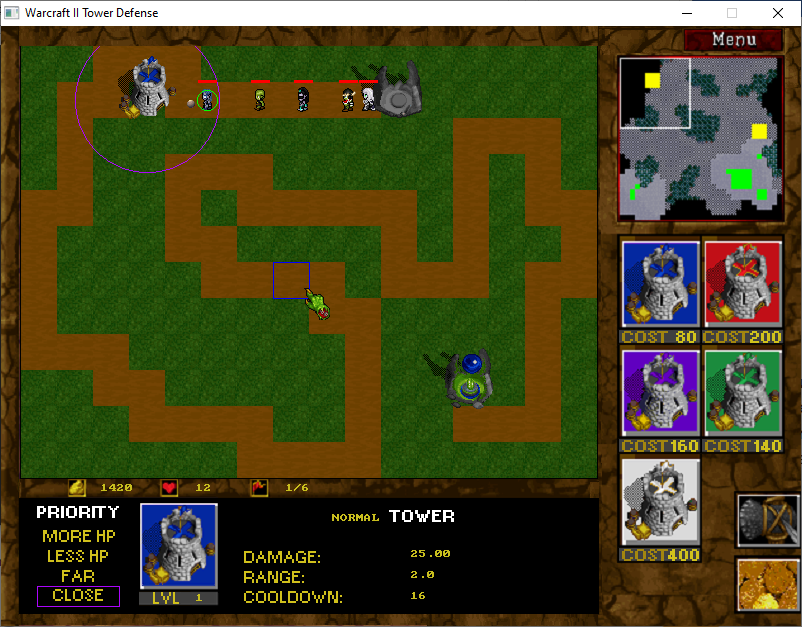

# Tower Defence Game
This game was create on Informatics Center, Federal University of Pernambuco (UFPE) (http://www2.cin.ufpe.br/en/) as final project from Programming Introduction course (2013.1).

It is a 2d tower defense game style with Warcraft II Theme. It was programmed in C language together with Allegro library on Windows platform using Code::Blocks IDE.

This is a strategy game where you use towers to defend your base from enemies.

The main features of the Warcraft II Tower Defense game, as seen in the image, are:
* Towers: There are different types of towers you can build, with different costs, damage, range and cooldowns. In the image, there are four towers you can build each with a special functionality. 
* Upgradeable towers: You can upgrade your towers to make them more powerful.
* Enemies: There are enemies that try to get to your base. You need to place your towers strategically to kill the enemies before they reach your base. The enemies have different abilities and HP (Health Points).
* Resources: You collect resources (gold) to build towers and upgrade them.

Developers: Rebecca Rolim and Rodolfo Andrade

To play on Windows, double-click the TD.exe file inside the folder Warcraft_II_TD/TD.

Have fun playing it! :D
